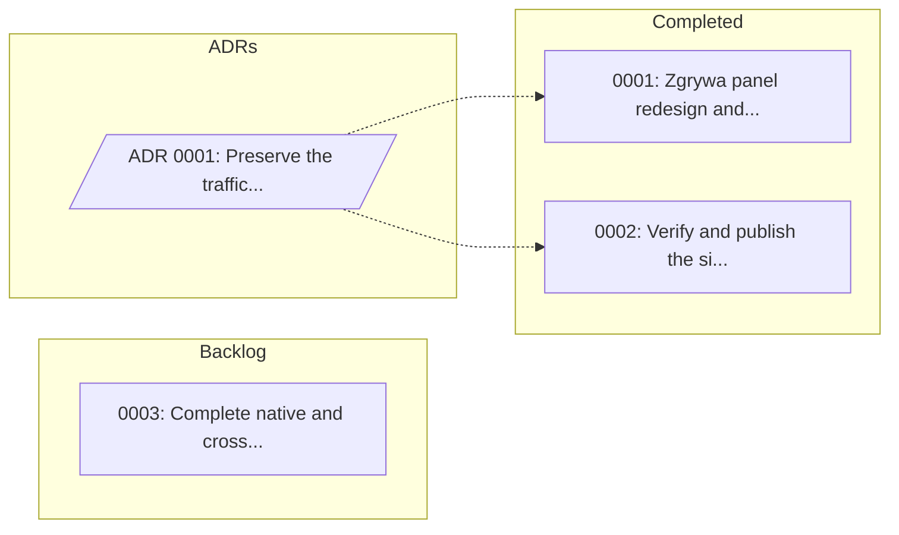

# Lore Index

> Auto-generated on 2026-09-01 12:18. Do not edit manually.
> Use `lore_generate-index` tool to regenerate.

Quick reference for task dependencies, status, and ADR relationships.

## Quick Stats

| Active | Blocked | Backlog | Completed | ADRs |
|:------:|:-------:|:-------:|:---------:|:----:|
| 0 | 0 | 1 | 2 | 1 |

## Dependency Graph

## Task Status

| ID | Title | Type | Status | Blocked By | Blocks | ADRs |
|:---|:------|:-----|:-------|:-----------|:-------|:-----|
| 0003 | [Complete native and cross-Mac accep...](lore/1-tasks/backlog/0003_FEATURE_native-cross-mac-acceptance.md) | FEATURE | backlog | — | — | — |
| 0001 | [Zgrywa panel redesign and audit fix...](lore/1-tasks/archive/0001_FEATURE_zgrywa-panel-and-audit-fixes/README.md) | FEATURE | completed | — | — | 0001 |
| 0002 | [Verify and publish the signed 0.4 r...](lore/1-tasks/archive/0002_FEATURE_signed-release-acceptance/README.md) | FEATURE | completed | — | — | 0001 |

## Architecture Decision Records

| ID | Title | Status | Related Tasks |
|:---|:------|:-------|:--------------|
| 0001 | [Preserve the traffic ledger when resetting hotspot statistics](lore/2-adrs/0001_preserve-traffic-ledger-on-hotspot-reset.md) | accepted | 0001, 0002 |

## Legend

**Task Status:**
- `active` — Work can proceed
- `blocked` — Waiting on dependencies
- `backlog` — Planned but not yet started
- `completed` — Done, in archive

**Graph Arrows:**
- `A --> B` — A blocks B (B depends on A)
- `ADR -.-> Task` — ADR informs Task
